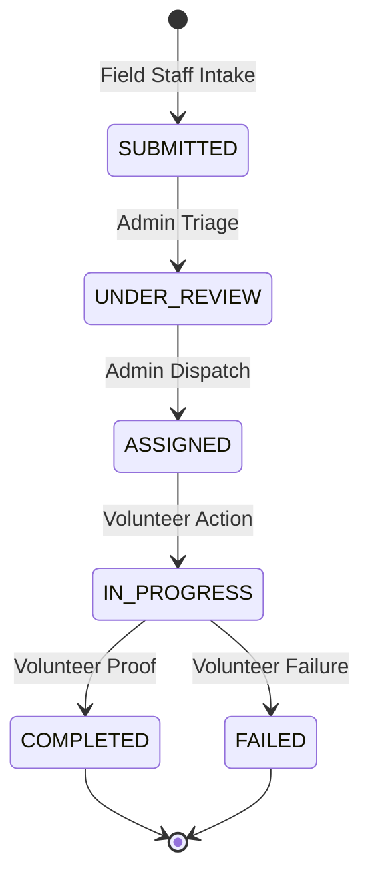

# SevaGrid Full Application Workflow

SevaGrid operates on a highly structured **tripartite role system**, designed to ensure seamless synchronization between identifying a community problem onto the field and successfully executing its resolution. Below is the full operational workflow of the service lifecycle.

> Note: All portals and users interact with a centralized, unified Next.js + Supabase backend. When data is modified in one portal, it synchronously reflects globally governed by strict Role-Based Access Controls (RBAC).

---

## The Core Lifecycle: A Single Mission

Every task or event in SevaGrid is defined as a `Case`. A single case goes through the following unified state machine synchronized across all interconnected portals:

### Phase 1: Intake (Field Staff Portal)
*   **Actor**: Field Staff
*   **Action**: A field agent discovers a critical need (e.g., infrastructural damage, medical requirement, supply shortage) at a local site.
*   **Process flow**:
    1.  The agent opens the Field Staff portal (`/fieldstaff`).
    2.  They navigate to **Report New Case** (`/fieldstaff/create-case`).
    3.  A 5-step interactive capsule form collects contextual data (Severity, Impact size, Geolocation, Photos, and Notes).
    4.  Upon submission, the data transmits to the central database, marking the Case as `SUBMITTED`.
    5.  *Sync Result*: The case appears instantly in the Admin's Global Queue, triggering real-time notification hooks.

### Phase 2: Triage & Dispatch (Admin Portal)
*   **Actor**: Central Administrator
*   **Action**: Evaluating incoming requests, assigning priorities, and allocating resources.
*   **Process flow**:
    1.  Admin logs into the command center (`/admin`).
    2.  They monitor the **Incoming Needs Queue** (`/admin/cases`) utilizing multi-parameter dropdown filtering.
    3.  Admin reviews the case specifics (`/admin/cases/[id]`). Based on the Field Staff's notes, the Admin upgrades/downgrades the severity.
    4.  Admin opens the **Volunteer Directory** (`/admin/volunteers`) to check local resource availability using the SevaGrid optimization engine (matching skills + proximity).
    5.  The case is formally assigned. State changes to `ASSIGNED`.
    6.  *Sync Result*: The case disappears from "Ready" queues and appears directly on the assigned Volunteer's active dashboard. The Field staff sees the updated status in their "My Cases" history list.

### Phase 3: Execution (Volunteer Portal)
*   **Actor**: Local Volunteer
*   **Action**: Receiving dispatch orders, traveling to the location, and fixing the problem.
*   **Process flow**:
    1.  Volunteer logs in and sees an alert for a new task on their Dashboard (`/volunteer`).
    2.  They open **Active Assignments** (`/volunteer/tasks`) and review the operation requirements and location map.
    3.  Upon arrival and action, the volunteer updates the case status to `IN_PROGRESS`.
    4.  Once the issue is resolved (or deemed unsolvable), the volunteer uploads internal evidence (Photos/Summary notes).
    5.  State changes to `COMPLETED` (or `FAILED` if escalated).
    6.  *Sync Result*: The action vanishes from the volunteer's active queue and moves to their localized **Contribution History** (`/volunteer/history`). The central database calculates the Volunteer's XP/Impact multiplier automatically.

### Phase 4: Resolution & Analytics (Global Sync)
*   **Actor**: Automated System & Admin
*   **Action**: Quantifying community impact and updating macro-statistics.
*   **Process flow**:
    1.  The `COMPLETED` trigger routes the data back to the **Operational Analytics** center (`/admin/analytics`).
    2.  The case metadata automatically populates the master `Impact Metrics` charts (Case Categories mapping, Priority Distribution arrays, Weekly Response Trends).
    3.  The volunteer’s success increments their personal rating and task counts across the system, increasing their probability of being matched to higher-tier tasks in the future.

---

## Directory & Portal Routing Map

Here is how the physical routing seamlessly enforces the user workflows across the platform mapping:

| Route Path | Accessibility Role | Primary Purpose | Synchronized Triggers |
| :--- | :--- | :--- | :--- |
| `/auth/login` | Public | Identity routing | Sets global Context provider `useAuth()` |
| `/fieldstaff/create-case` | Field Staff | Step-by-step issue intake | Triggers global `Case` creation pipeline |
| `/fieldstaff/my-cases` | Field Staff | Monitor personal requests | Listens to Admin status alterations |
| `/admin` | Admin | Macro-overview statistics | Reads total operational throughput live |
| `/admin/cases` | Admin | Central Triage command | Routes `FieldStaff` intake to `Volunteers` |
| `/volunteer` | Volunteer | Immediate call-to-action hub | Listens to Admin dispatches |
| `/volunteer/tasks/[id]` | Volunteer | Ground-Zero execution | Triggers `COMPLETED` pipeline to Analytics |

**Data Consistency Strategy**: 
SevaGrid enforces a unidirectional data flow. Field Staff **create**, Admins **read and route**, Volunteers **update to close**. This architecture structurally prevents state-conflicts and maintains perfect synchronization across all local device renderers.
